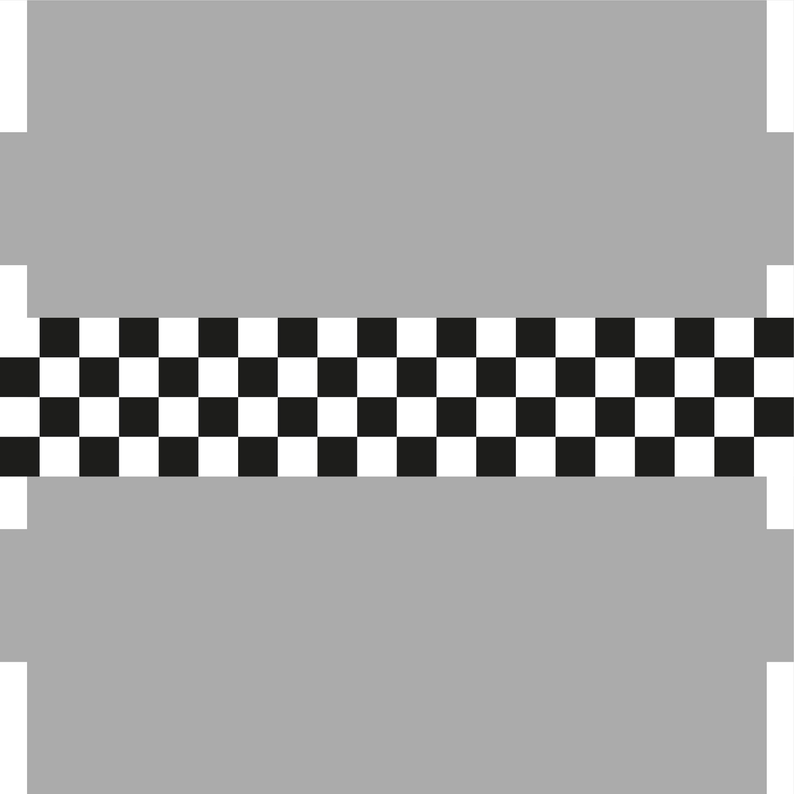

# Crazy highway

## Základný popis

Cieľom zadania je vytvoriť hru na báze jazykov HTML, CSS a JavaScript ako progresívnu webovú aplikáciu.
V našom prípade je cieľom hry prejsť automobilom po ceste až do cieľa a vyhnúť sa pri tom prekážkam v ceste.
Základný pohľad v hre je tvorený v závislosti od levelu z cesty šírky n pruhov. Na spodnej strane sa nachádza 
automobil, ktorým je možné pohybovať sa medzi pruhmi a tým prejsť až do cieľa. Cesta sa "roluje" v konštantnom čase, 
čo pôsobí akoby sa automobil hýbal vpred.
---
### Herné prostredie
Každý level je defaultne definovaný v JSON obbjekte ako pole čísel, ktoré predstavujú konkrétny objekt na ceste.
Objekty v poli sú definované ako:

0. cesta
1. diera
2. konár
3. kúžel
4. cieľ
5. auto na ceste
6. auto v diere
7. auto s konárom
8. auto s kúželom
9. auto v cieli

### Prečo?
Čísla sú navrhnuté pre jednoduchú implementáciu auta na ceste. Vždy, keď sa na pole presunie auto, 
stačí k príslušnému prvku v 2D poli pripočítať číslo 5 alebo naopak odpočítať číslo 5 ak sa auto presunie
na iné políčko. <br>
Časť pola cesty by teda mohla vyzerať napríklad takto:

| **4** | **4** | **4** |
|-------|-------|-------|
| **1** | **0** | **2** |
| **0** | **0** | **0** |
| **0** | **5** | **0** |

Výsledná časť cestz by teda vyzerala nejako takto: <br><br>
 <br>
 <br>
 <br>
 <br>


Týmto spôsobom je tiež možné definovať pole premeny čísla na cestu ku konkrétnemu obrázku, kde index do poľa ciest 
bude predstavovať číslo daného obrázka, čo značne zjednoduší konverziu prvkov na ceste na obrázky.


| **index** | 0                  | 1                  | 2                  | 3                  | ...                |
|-----------|--------------------|--------------------|--------------------|--------------------|--------------------|
| **cesta** | "../img/cesta.jpg" | "../img/diera.jpg" | "../img/konar.jpg" | "../img/kuzel.jpg" | "../img/ ... .jpg" | 


### JSON

Základné prvky hry, ktorými sú konverzná tabuľka/pole, alternatívny text a jednotlivé levely sú definované v JSON dokumente
so štruktúrou:

```json

{
   "conversion_table": 
   [ "../img/cesta.jpg" , 
     "../img/diera.jpg" , 
     "../img/konar.jpg" , 
     "../img/kuzel.jpg" ,
     "../img/ ... .jpg" ],
   "alt": ["cesta",
     "diera na ceste",
     "konár na ceste",
     "kúžel na ceste"],
   "levels": [
   [[4,4,4],
    [1,0,2],
    [0,0,0],
    [0,1,0],
    []
   ],
   [[4,4,4,4],
    [1,0,2,0],
    [0,0,0,3],
    [0,1,0,0],
    []
   ]
   ]
}

```

---

### Todo list:

- [x] Vytvoriť validný JSON levelov a konverznej tabuľky
- [x] Načítanie JSON a rozparsovanie do použiteľných polí
- [x] Dynamické vytvorenie polí (div) v hlavnom okne hry podľa šírky herného pola
- [x] Výpis aktuálneho stavu cesty
- [x] Pravidelná zmena pola aktuálnej časti cesty, ktorú používateľ vidí a výpis pomocou funkcie definovanej vyššie
- [x] Definovanie listenera na klávestnicu
- [x] Definovanie listenera na swipe
- [ ] Definovanie listenera na gyroskop (acceleration including gravity - zmena prvého parametra)
- [x] prepínanie levelov pri prejdení levelu a zopakovanie pri neprejdení
- [x] tlačidlo pomôcky, ktoré zastaví hru a zobrazí modalne okno s tutorialom ako hrat hru
- [x] úvodné menu dynamicky vytvárané
- [ ] progresívna web aplikácia
- [x] favicon
- [x] cookies
- [ ] optimalizácia pre tlač


